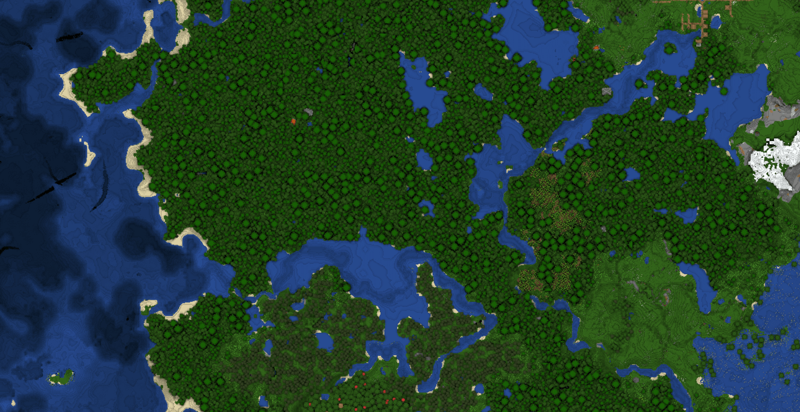

# Voxel Noise Renderer

### Installation and usage
* Install [Node.JS](https://nodejs.org/en/) on your machine
* Clone the repository and navigate to the root folder
* Install dependencies: `npm install .`
* Start the main server script: `node .`
* Open the viewer in your browser: `http://localhost:8081`

### Viewer shortcuts
* <kbd>C</kbd>: Clear chat window
* <kbd>F</kbd>: Reconnect to server
* <kbd>R</kbd>: Reload shaders
* <kbd>Shift</kbd> + <kbd>0</kbd>: Reset current shader to default
* <kbd>Shift</kbd> + <kbd>1</kbd>..<kbd>9</kbd>: Set current shader to a different one

### Known issues
* Connection refused when receiving chunk data (unconfirmed)

### Sending chunk data
*Note: This is not final and will probably change soon, see `example` folder for more details.*
Chunk data can be currently sent with a POST request to `http://localhost:8081/api/set-chunk?x=&z=`.
The server expects the data to be a raw array of bytes, each block is represented by its RGB color.